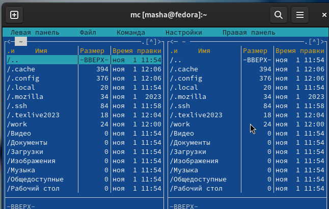
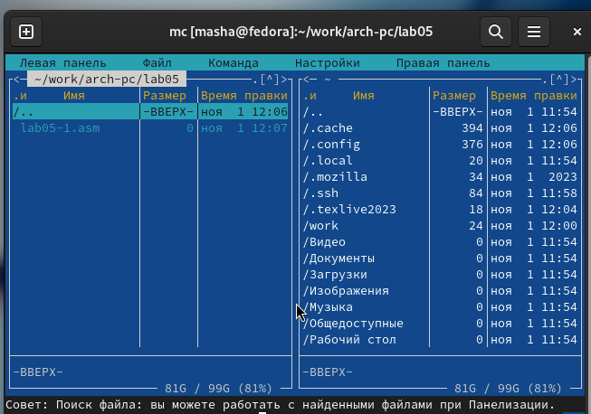
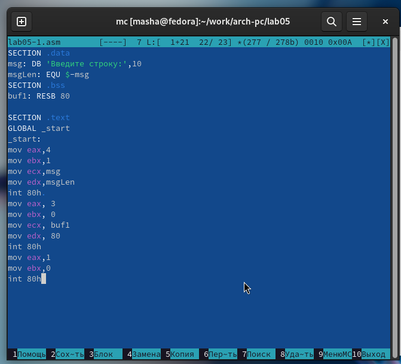
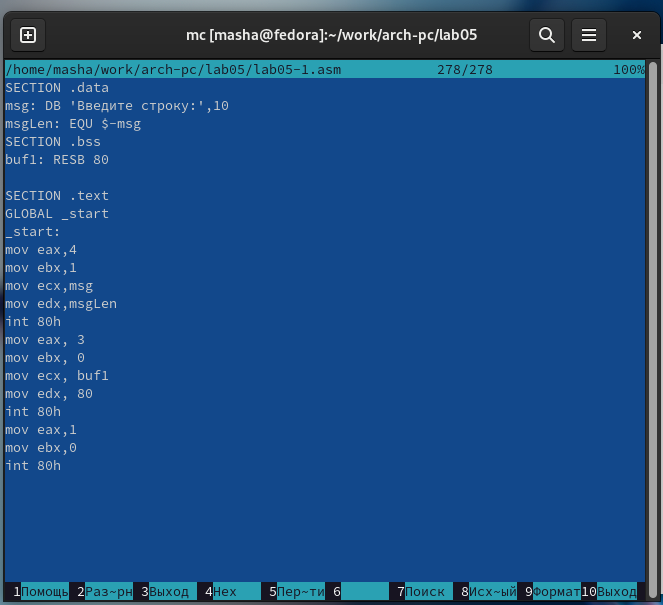
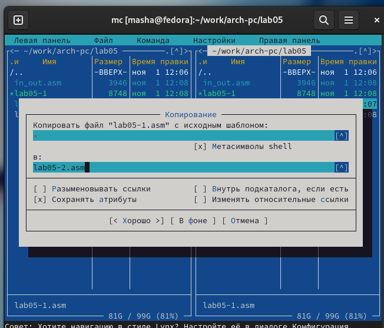
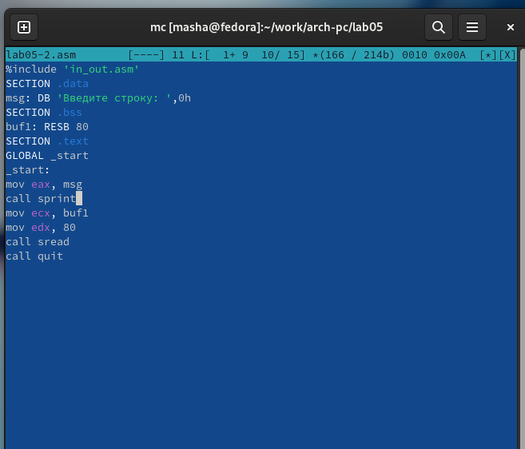
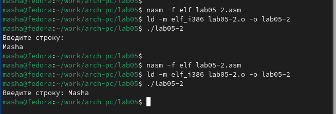
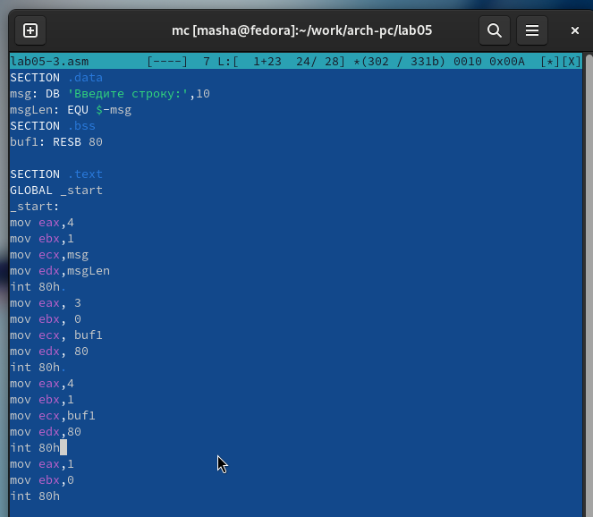
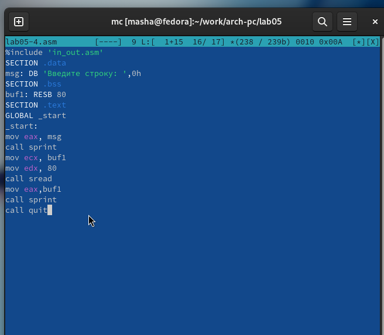

---
## Front matter
title: "Лабораторная работа №5"
subtitle: "Архитектура компьютеров"
author: "Ермишина Мария Кирилловна"

## Generic otions
lang: ru-RU
toc-title: "Содержание"

## Bibliography
bibliography: bib/cite.bib
csl: pandoc/csl/gost-r-7-0-5-2008-numeric.csl

## Pdf output format
toc: true # Table of contents
toc-depth: 2
lof: true # List of figures
lot: true # List of tables
fontsize: 12pt
linestretch: 1.5
papersize: a4
documentclass: scrreprt
## I18n polyglossia
polyglossia-lang:
  name: russian
  options:
	- spelling=modern
	- babelshorthands=true
polyglossia-otherlangs:
  name: english
## I18n babel
babel-lang: russian
babel-otherlangs: english
## Fonts
mainfont: PT Serif
romanfont: PT Serif
sansfont: PT Sans
monofont: PT Mono
mainfontoptions: Ligatures=TeX
romanfontoptions: Ligatures=TeX
sansfontoptions: Ligatures=TeX,Scale=MatchLowercase
monofontoptions: Scale=MatchLowercase,Scale=0.9
## Biblatex
biblatex: true
biblio-style: "gost-numeric"
biblatexoptions:
  - parentracker=true
  - backend=biber
  - hyperref=auto
  - language=auto
  - autolang=other*
  - citestyle=gost-numeric
## Pandoc-crossref LaTeX customization
figureTitle: "Рис."
tableTitle: "Таблица"
listingTitle: "Листинг"
lofTitle: "Список иллюстраций"
lotTitle: "Список таблиц"
lolTitle: "Листинги"
## Misc options
indent: true
header-includes:
  - \usepackage{indentfirst}
  - \usepackage{float} # keep figures where there are in the text
  - \floatplacement{figure}{H} # keep figures where there are in the text
---

# Цель работы

Целью работы является приобретение практических навыков работы в Midnight Commander. 
Освоение инструкций языка ассемблера mov и int.

# Выполнение лабораторной работы

## Знакомство с Midnight Commander

Я открываю Midnight Commander и с помощью клавиш со стрелками и Enter перехожу в каталог `~/work/arch-pc`. Затем нажимаю F7, чтобы создать новый каталог `lab05`.

{ #fig:001 width=70%, height=70% }

{ #fig:002 width=70%, height=70% }

Используя команду `touch`, создаю файл `lab05-1.asm`.

{ #fig:003 width=70%, height=70% }

{ #fig:004 width=70%, height=70% }

Открываю файл на редактирование, нажав клавишу F4. Выбираю редактор `mcedit` и пишу код программы согласно заданию.

{ #fig:005 width=70%, height=70% }

Для проверки кода открываю файл на просмотр, нажав клавишу F3, и убеждаюсь, что он содержит необходимый текст.

{ #fig:006 width=70%, height=70% }

Затем я компилирую файл программы в объектный файл, выполняю компоновку объектного файла и получаю исполняемый файл программы.

{ #fig:007 width=70%, height=70% }

## Подключение внешнего файла in_out.asm

Скачиваю файл `in_out.asm` и помещаю его в рабочий каталог. Для копирования файла использую клавишу F5, а для перемещения — клавишу F6.

{ #fig:008 width=70%, height=70% }

Затем я копирую `lab05-1.asm` в `lab05-2.asm`.

{ #fig:009 width=70%, height=70% }

В новом файле `lab05-2.asm` пишу код программы с использованием подпрограмм из внешнего файла `in_out.asm`.

{ #fig:010 width=70%, height=70% }

После компиляции программы я проверяю её запуск.

{ #fig:011 width=70%, height=70% }

В файле `lab05-2.asm` я заменяю подпрограмму `sprintLF` на `sprint`, после чего заново собираю исполняемый файл.

{ #fig:012 width=70%, height=70% }

{ #fig:013 width=70%, height=70% }

Теперь после вывода строки программа не завершается символом перехода на новую строку.

## Задание для самостоятельной работы

Я скопировала программу `lab05-1.asm` и изменила код так, чтобы она работала по следующему алгоритму:

* вывести приглашение типа “Введите строку:”;
* ввести строку с клавиатуры;
* вывести введённую строку на экран.

{ #fig:014 width=70%, height=70% }

{ #fig:015 width=70%, height=70% }

Аналогичным образом я скопировала программу `lab05-2.asm` и изменила код, но теперь использовала подпрограммы из файла `in_out.asm`.

{ #fig:016 width=70%, height=70% }

{ #fig:017 width=70%, height=70% }

# Выводы

Научились писать базовые ассемблерные программы. Освоили ассемблерные инструкции mov и int.